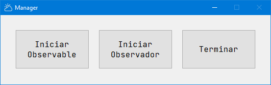
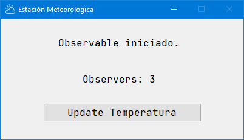
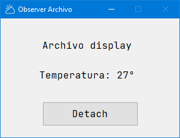
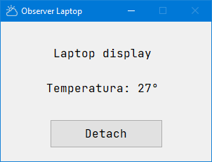

# Estación Meteorológica
Entrega final del nivel avanzado del curso Python 3 de Facultad Regional Buenos Aires de la Universidad Tecnológica Nacional.

### Grupo de Trabajo
* Luis Elías Carro
* Christian Maier

### Profesores
* Gabriela Verónica Aquino
* Brenda Abigail Barreto Aquino
* Juan Marcelo Barreto Rodriguez

## Descripción
El programa simula una estación meteorológica que informa la temperatura. Distintos dispositivos pueden suscribirse (attach) para recibir esta información y cancelar esta suscripción (detach) cuando deseen hacerlo.

Este proyecto cumple con:
* Patrón de diseño Observer. 
* Patrón de diseño MVC.
* Uso de ORM peewee con SQLite.
* Registro de log mediante decoradores.

El módulo principal es ```main.py```.

El patrón de diseño ```Observer``` se presenta con una clase ```Subject``` como el elemento a observar, al que los ```Observers``` se suscriben para recibir información. Nosotros decidimos llamar a esta clase ```Observable```.

## Fuentes Consultadas.
* Documentos y videos entregados en este curso.
* [Observer Pattern: Christopher Okhravi](https://youtu.be/_BpmfnqjgzQ)
* [Observer method – Python Design Patterns](https://www.geeksforgeeks.org/observer-method-python-design-patterns/#:~:text=The%20observer%20method%20is%20a,object%20that%20they%20are%20observing.)
* [Creating additional windows](https://www.pythonguis.com/tutorials/creating-multiple-windows/)
* [Having trouble opening multiple windows in PyQt5](https://stackoverflow.com/questions/52797269/having-trouble-opening-multiple-windows-in-pyqt5)

## Requerimientos.
Es conveniente (aunque no necesario) crear un entorno virtual para instalar:
```
pip install SIP
pip install PyQt5
pip install pyqt5-tools
pip install PySide2
pip install QT-PyQt-PySide-Custom-Widgets
pip install pyqt5-tools
pip install peewee
```

## Pantalla Principal.



La pantalla principal (llamada Manager) permite:
### Iniciar Observable (Subject).
Solo es posible iniciar uno.
### Iniciar Observador (Observer).
Solo se pueden iniciar si el Observable está iniciado, no antes. Pueden crearse tantas instancias de Observer como se desee.
### Terminar.
Al terminar el programa se cierran todas las ventanas abiertas.

## Observable (Subject).



La vista del observable lleva la cuenta de los observadores suscriptos y el botón Update Temperatura informa a cada uno un valor de temperatura aleatorio en el rango (-10, 40).

## Observador (Observer).





Los observadores pueden ser de tres tipos:
* Archivo
* Telefono
* Laptop

El tipo está determinado por un valor aleatorio en el rango (1, 3). 
Cada vez que desde el manager se agrega un observador, será de un tipo elegido al azar y se abrirá una vista que lo representa.
La vista del observador muestra la temperatura informada por el observable.
El botón Detach elimina la instancia de la lista, esto se ve reflejado en la vista del Observable y se cierra a vista del Observer.

## SQLite.
Cada actualización hecha desde el Observable es guardada en una base de datos SQLite (./db/observer_base.db) creada por el programa mediante el uso peewee.
Solo existe la tabla Observaciones con los campos:

| Nombre | Tipo | Aclaración |
| :---: | :---: | :---: |
| Id | INT AUTOINCREMENT | Creado por el ORM |
| Fecha | DATETIME | Guarda la fecha de creación del registro |
| Observador | TEXT | El tipo de observador que guarda el registro |
| Descripcion | TEXT | Siempre dice "Temperatura" |
| Valor | INT | Valor informado por el observable|

## Decoradores.
Se implementaron dos decoradores: uno de clase y uno de método de clase.

### Decorador de clase:
Ubicado en ```modulos/deco_clase.py``` registra en un archivo de texto Clase.Método o Clase.Atributo sin considerar parametros.
Este decorador está asociado a las clases:
* Controller
* Model
* ServicioMeteorologico

Agrega una línea por cada acción registrando por ejemplo:
```
15:14:33 --> ServicioMeteorologico.attach
15:14:33 --> ServicioMeteorologico._observers
15:15:00 --> Controller.save
15:15:00 --> Model.save
```

### Decorador de método de clase:
Ubicado en observer/concrete.py registra en un archivo de texto la ejecución de los métodos decorados complementando al decorador de clase.
Se asocia los métodos:
* ServicioMeteorologico.attach
* ServicioMeteorologico.detach
* ServicioMeteorologico.notify
* ServicioMeteorologico.informa_temperatura
* Archivo.update
* Laptop.update
* Telefono.update

Agrega una línea por cada acción registrando, por ejemplo:
```
15:15:00 --> ServicioMeteorologico.informa_temperatura
15:15:00 --> actualizando observer Archivo
15:15:00 --> actualizando observer Laptop
15:15:00 --> actualizando observer Telefono
```

El archivo de texto es siempre el mismo y lleva como nombre ```log_YYYY_mm_dd```. Su ubicación es una constante asegurando que ambos decoradores abrirán en modo append el mismo archivo para crear lineas.